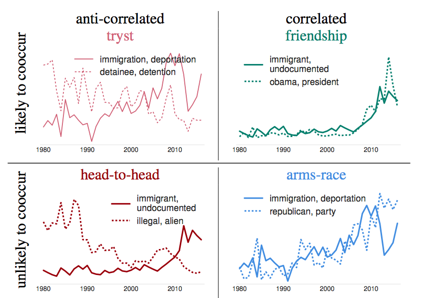

# Relations between ideas

This project provides a framework to identify relations between ideas in temporal text corpora.
Because ideas are naturally embedded in texts, we propose a framework to systematically characterize the relations between ideas based on their occurrence by combining two statistics: cooccurrence within documents and prevalence correlation over time.
This framework reveals four possible relations between ideas as shown in the following quadrants:
* friendship: two ideas tend to cooccur, and are correlated in prevalence;
* head-to-head: two ideas rarely cooccur, and are anti-correlated in prevalence;
* tryst: two ideas tend to cooccur, but are anti-correlated in prevalence;
* arms-race: two ideas rarely cooccurr, but are correlated in prevalence.



Refer to [our paper](https://chenhaot.com/pages/idea_relations.html) for our initial exploration using this framework on news issues and research papers.

This framework is independent of how we represent ideas. In this repository, we showcase our framework by using topics from Latent Dirichlet Allocation (Blei et al. 2003) and keywords identified using Fightin' words (Monroe et al. 2008).


### Usage

```
python main.py [--option {topics,keywords}] [--input_file INPUT_FILE] \
               [--group_by {year, month, quarter}] \
               [--data_output_dir DATA_OUTPUT_DIR] \
               [--final_output_dir FINAL_OUTPUT_DIR] \
               [--mallet_bin_dir MALLET_BIN_DIR] \
               [--background_file BACKGROUND_FILE] [--prefix PREFIX] \
               [--num_ideas NUM_IDEAS] \
               [--tokenize] [--lemmatize] [--nostopwords]
```

`input_file` is a data file, where each line corresponds to a document and is a json object with two fields (`text` for the content; `date` for the timestamp, e.g., 20000101).

In the `final_output_dir`, there will two sub directories, `figure/` and `table/` and also a tex file (e.g., immigration\_topics\_main.tex) that can be compiled to generate a report pdf file.
The outputs in `figure/` include relative frequency over time for pairs of ideas with the strongest relation in each of the four types of relation above, and a file `*_comb_extreme_pairs.txt` with sorted pairs of relations with their relation type, cooccurrence, prevalence correlation, and strength.
The outputs in `table/` are necessary for the compilation of the main tex file.

If `topics` is used to represent ideas, [Mallet](http://mallet.cs.umass.edu/) is required to generate topics for each document (`mallet_bin_dir` is required).
Alternatively, it works as long as there are mallet style topic files in `data_output_dir`.

If `keywords` is used to represent ideas, `background_file` is required to learn `num_ideas` keywords as representations.

`tokenize`, `lemmatize` and `nostopwords` are preprocessing options that we currently support.

`example.sh` gives example commands for using our framework. You can also download example datasets from ACL and NIPS [here](https://chenhaot.com/pages/idea_relations.html).

We list all packages used in requirements.txt. 
One way to install these packages is to run `pip install -r requirements.txt`;
alternatively, one can use `conda create --name idea_relations --file requirements.txt` to create a new environment for running this package.
The package will automatically produce a pdf freport if there exists a TeX installation.


If you have any questions regarding the framework or usage of this repository, please direct your questions to [Chenhao Tan](https://chenhaot.com) and [Dallas Card](http://www.cs.cmu.edu/~dcard/).

